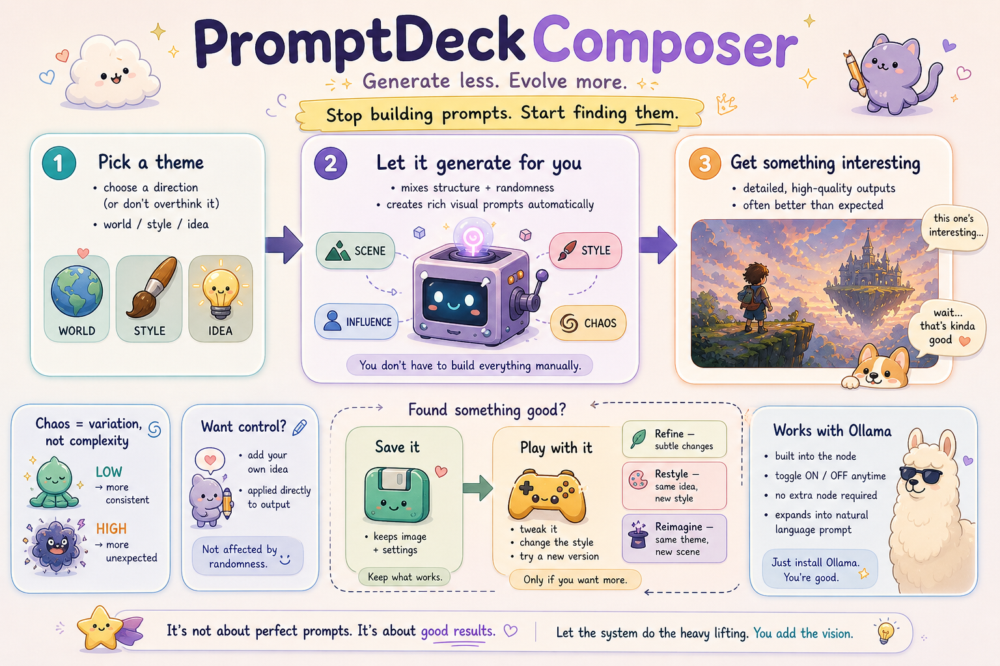

# PromptDeckComposer

**Generate less. Evolve more.**

A structured + chaos-based prompt generation system for ComfyUI.
Stop building prompts manually. Start discovering them.

---

## 🧭 What is this?

PromptDeckComposer is a creative system designed to:

* generate rich visual prompts automatically
* combine structure + controlled randomness
* help you discover better results faster
* evolve results instead of rebuilding from scratch

It is not about perfect prompts.
It is about **good results**.

---

## ⚡ Core Idea

> Start with randomness. Keep what works. Evolve only when needed.

Instead of manually crafting prompts:

1. Generate structured random prompts
2. Get interesting visual results
3. Save strong outputs
4. Explore variations only if needed

---

## 🔁 Workflow

**THEME / INPUT → STRUCTURED + CHAOS ENGINE → RICH OUTPUT**

Optional:

**SAVE → EXPLORE (refine / restyle / reimagine)**

---

## 🎛 Key Features

### 🎲 Structured + Chaos Generation

* Combines scene, style, and artist influence
* Controlled randomness via CHAOS LEVEL
* Produces detailed prompts automatically

### 🧠 Built-in LLM (Ollama)

* Integrated directly into the node
* Toggle ON / OFF anytime
* No extra node required
* Expands structured prompts into natural language

> Ollama itself must be installed separately.

### 💾 Result-Based Workflow

* Save images + full settings
* Reuse strong outputs
* Build from results, not randomness

### 🔍 Optional Exploration

* **Refine** → subtle variation
* **Restyle** → same idea, new style
* **Reimagine** → same theme, new scene

---

## 🎛 Controls Explained

### CHAOS LEVEL

Controls variation, not complexity.

* Low → more consistent
* High → more unexpected

Affects only random generation.

---

### USER PROMPT

* Applied directly to the final output
* Not affected by randomness
* Acts as a fixed creative anchor

---

## 🧩 Installation

```bash
git clone https://github.com/chkeeho80/PromptDeckComposer
```

Place inside:

```text
ComfyUI/custom_nodes/
```

Restart ComfyUI.

Node location:

```text
prompt/PromptDeckComposer → PromptDeckComposer
```

---

## 🧪 Example Output

A typical generated prompt may look like:

```text
young woman made of herbs standing with mechanical raven in rainy neon alley, under neon rim lighting, in teal and amber, with soft film grain, dreamlike and quiet, cinematic concept art, inspired by Caravaggio and Gustav Klimt...
```

---

## 🎨 Customization

Edit:

```text
composer_deck.json
```

You can modify:

* themes
* style pools
* artist sets
* structure elements

⚠ Keep top-level pool names unchanged.

---

## 💡 Philosophy

PromptDeckComposer is built for:

* creators who are tired of manual prompt crafting
* users who want fast, rich results
* exploration through controlled randomness

---

## 🧠 Summary

* Random generation is the starting point
* Structure shapes the result
* Good outputs become the foundation
* Evolution is optional

---

**Randomness starts the spark.
You decide what becomes something more.**
